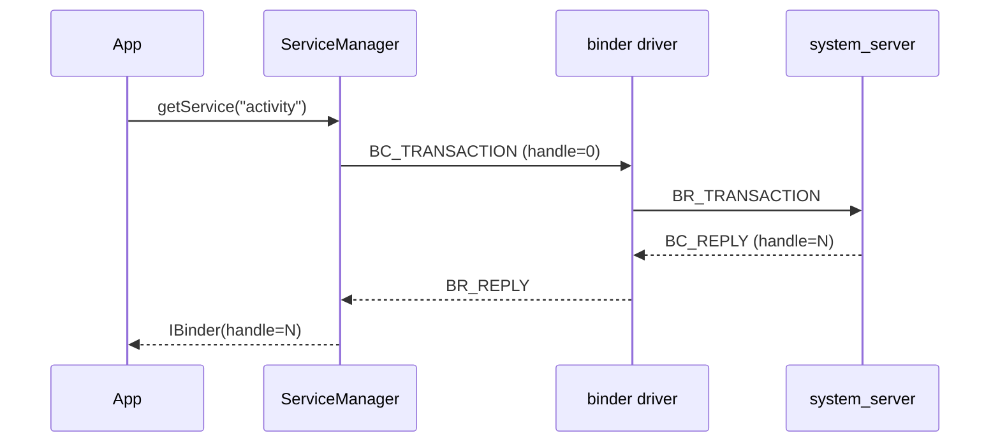

# Style Guide — AOSP Book

This style guide is **mandatory** for every chapter, appendix, and lab in this book. It exists so the book reads as one coherent voice and so a reader on Day 47 can switch to Day 82 without learning a new format.

---

## 1. The 6-Block Chapter Template

Every chapter (and every numbered subsection deeper than `§x.y.z` whose scope warrants it) follows these six blocks **in order**:

```markdown
## §X.Y Title of Topic

### 🟦 Why it matters
3–6 lines. Frame the topic against a *production bug* or *business outcome*.
Bad: "Binder is Android's IPC."
Good: "Every `dumpsys` you run, every Intent broadcast, every Camera frame
delivered to your app crosses Binder. A 200µs regression here costs 4% of
cold-start budget on a midrange SoC — which is why Binder fast-path is on
every staff-level interview rubric."

### 📐 Concept
First-principles explanation. Always include at least one diagram (mermaid or
ASCII). Define every acronym on first use; cross-reference the glossary.

### 🛠️ Code Lab — <name> (Android 15)
Copy-paste runnable on Cuttlefish unless stated. Every lab MUST have:
- A "Setup" subsection (env, target, prerequisites)
- A "Steps" subsection (numbered, idempotent)
- A "Verifying" subsection (exact expected output, log lines, dumpsys excerpt)
- A reference to the runnable tree in `curriculum/labs/<name>/`

### ⚠️ Pitfalls
3–6 real-world mistakes. Each pitfall = one bullet, one line of cause, one
line of fix. Prefer mistakes you have actually seen at OEMs/Tier-1s.

### 🎓 Interview Questions
5–10 Qs with **model answers** (not just questions). Tag each with difficulty
[Junior | Mid | Senior | Staff] and cross-link the canonical entry in
`appendix-a-interview-bank.md`.

### 📋 Cheat-sheet
5–15 one-liners: commands, file paths, ADB incantations, useful greps.
Cross-link `appendix-b-daily-reference.md`.
```

A chapter may have multiple §-level topics; each one repeats the 6 blocks. End the chapter file with a single `## ✅ Verifying this chapter` section listing the 3–5 things a reader should be able to do/explain after finishing.

---

## 2. Callout Glyphs (use exactly these)

| Glyph | Meaning | When to use |
|---|---|---|
| 🟦 | Concept | The "what / why" theory block |
| 📐 | Diagram | Anything visual (mermaid/ASCII) |
| 🛠️ | Code Lab | Hands-on, runnable |
| 🐞 | Production Bug | Real-world incident war story |
| ⚠️ | Pitfall | Things that bite OEMs |
| 🎯 | Staff Insight | "How a principal would frame this" |
| 🔗 | Cross-reference | Pointer to another chapter/appendix |
| 🎓 | Interview Q | Question + model answer |
| 📋 | Cheat-sheet | One-liner reference |
| 🧪 | Verifying | "How you know it worked" |
| 📦 | Version Note | "Differs in Android 14 / 16" |

---

## 3. Diagrams

- **Prefer mermaid** for flowcharts, sequence diagrams, state machines, class hierarchies.
- **Use ASCII** for: memory layouts, partition tables, register maps, file-tree snippets — anything where horizontal alignment matters.
- Every diagram needs a one-line caption *below* it.

Example mermaid sequence:

*Figure 2.3 — Resolving an AMS service handle via ServiceManager.*

---

## 4. Code Block Conventions

- **Always** specify the language fence: ` ```bash `, ` ```cpp `, ` ```rust `, ` ```java `, ` ```kotlin `, ` ```aidl `, ` ```python `, ` ```dts `, ` ```te `, ` ```bp `, ` ```mk `, ` ```xml `, ` ```diff `.
- Shell prompts:
  - `$` — host (Linux dev box)
  - `cf:#` — Cuttlefish adb shell as root
  - `cf:$` — Cuttlefish adb shell as shell user
  - `dev:#` — physical device adb shell as root (userdebug)
- Long commands: split with `\` line continuations, never wrap silently.
- Filenames as headers immediately above the code block:
  ```
  **`device/google/cuttlefish/vendor/myhal/MyHal.cpp`**
  ```cpp
  // ...
  ```
  ```
- Any code lab longer than ~30 lines lives in `curriculum/labs/<name>/`; show only the meaningful slice in the chapter and link the full source.

---

## 5. Versioning Conventions

- The book's primary target is **Android 15** (`android-15.0.0_r*`).
- Use 📦 **Version Note** blocks for any 14↔15↔16 deltas:
  ```
  > 📦 **Version Note (Android 14):** This API takes a `Bundle` instead of a `PersistableBundle`.
  > 📦 **Version Note (Android 16, expected):** AIDL HAL versioning auto-bumps via VINTF freeze.
  ```
- Every Code Lab heading carries the version: `### 🛠️ Code Lab — Foo HAL stub (Android 15)`.

---

## 6. Cross-References

- Format: `[L3.4 §3.4.2 — VINTF compatibility matrix](./level-03-hal-native.md#342-vintf-compatibility-matrix)`
- Every Interview Q should link to its canonical entry in Appendix A: `(see [Appx A Q-073](./appendix-a-interview-bank.md#q-073))`.
- Every cheat-sheet line linkable in Appendix B.
- Run `python scripts/check_xrefs.py` before committing.

---

## 7. Voice & Tone

- Second person (**"you'll see..."**), present tense.
- Direct and dense; no marketing language.
- Define jargon on first use, then use freely.
- Numbers over adjectives: "≈18 ms cold-start cost", not "expensive".
- War stories are encouraged in 🐞 Production Bug callouts, anonymized.

---

## 8. File Naming

- `level-NN-<slug>.md` for spine chapters.
- `level-NNa-deep-dive-<slug>.md`, `level-NNb-...` for deep dives off a level.
- `appendix-<a-z>-<slug>.md` for appendices.
- `curriculum/week-NN/README.md` for weekly indexes.
- `curriculum/labs/<lab-slug>/` for runnable lab trees, each with its own `README.md`, `Android.bp`/`Makefile`, and source files.

---

## 9. Linting Checklist (pre-commit)

- [ ] Every `##` topic uses the 6-block template (or is explicitly an index/intro).
- [ ] Every code block has a language fence.
- [ ] Every shell command has a prompt prefix.
- [ ] All cross-refs resolve (`scripts/check_xrefs.py`).
- [ ] Every chapter ends with `## ✅ Verifying this chapter`.
- [ ] No "TODO" or "TBD" without an issue link.
- [ ] Acronyms defined on first use or linked to glossary.

---

*This guide governs every later edit. When in doubt, mimic the structure of `level-02-framework-internals.md` after its rewrite.*

