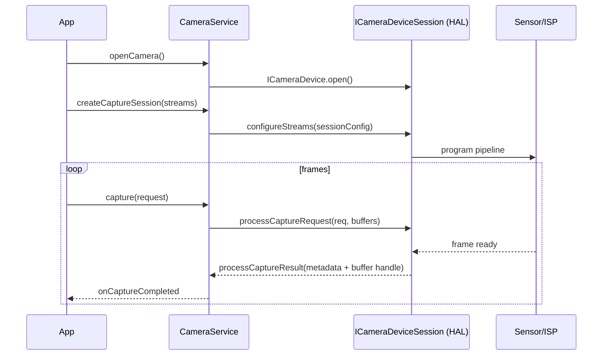
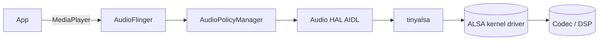
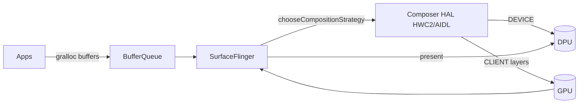

# Level 3A — Deep Dive: HAL Subsystems

> **Curriculum days:** 48–52 · **Prereq:** [L3 HAL & Native](./level-03-hal-native.md), [L2A Binder Native](./level-02a-deep-dive-binder-native.md)
> **Primary target:** Android 15 on Cuttlefish · **Audience:** Mid → Staff

The "HAL" is not one thing. It is a dozen subsystem-specific contracts that share a Binder transport (AIDL) and a manifest discipline (VINTF). This chapter walks the five most-asked subsystems: **Camera, Audio, Sensors, GNSS, NNAPI**, and finishes with the **Graphics/HWC2** stack.

---

## §3A.1 Camera HAL3 (Pipeline & Stream Configuration)

### 🟦 Why it matters
Camera is the highest-bandwidth, lowest-latency HAL on the device. A 0.5 ms regression in `processCaptureRequest` is a customer-visible shutter-lag bug. Knowing the pipeline cold is mandatory for camera bring-up roles at any OEM.

### 📐 Concept

Camera HAL3 is a request-driven pipeline. The framework sends `CaptureRequest`s containing `Stream`s and metadata; the HAL returns `CaptureResult`s asynchronously, in order.


*Figure 3A.1 — A Camera HAL session.*

Stream types: `PREVIEW`, `JPEG`, `YUV_420_888`, `RAW10/12/16`, `IMPLEMENTATION_DEFINED`. Buffers come via `BufferQueue`/gralloc. Each stream has a `usage` flag set determining gralloc allocation strategy.

### 🛠️ Code Lab — Minimal AIDL Camera HAL stub (Android 15)

Path: `hardware/google/camera_stub/aidl/`

**`Android.bp`**
```bp
cc_binary {
    name: "android.hardware.camera.provider-service.stub",
    relative_install_path: "hw",
    init_rc: ["camera-provider-stub.rc"],
    vintf_fragments: ["camera-provider-stub.xml"],
    vendor: true,
    srcs: ["service.cpp", "CameraProviderStub.cpp"],
    shared_libs: [
        "libbase", "libbinder_ndk", "liblog",
        "android.hardware.camera.provider-V2-ndk",
        "android.hardware.camera.device-V2-ndk",
    ],
}
```

**`camera-provider-stub.rc`**
```rc
service vendor.camera-provider-stub /vendor/bin/hw/android.hardware.camera.provider-service.stub
    interface aidl android.hardware.camera.provider.ICameraProvider/internal/0
    class hal
    user cameraserver
    group cameraserver
```

**`camera-provider-stub.xml`** (VINTF fragment)
```xml
<manifest version="1.0" type="device">
    <hal format="aidl">
        <name>android.hardware.camera.provider</name>
        <version>2</version>
        <fqname>ICameraProvider/internal/0</fqname>
    </hal>
</manifest>
```

**`service.cpp`** (excerpt)
```cpp
#include <android-base/logging.h>
#include <android/binder_manager.h>
#include <android/binder_process.h>
#include "CameraProviderStub.h"

int main() {
    ABinderProcess_setThreadPoolMaxThreadCount(4);
    auto provider = ndk::SharedRefBase::make<CameraProviderStub>();
    const std::string name =
        std::string() + ICameraProvider::descriptor + "/internal/0";
    binder_status_t s = AServiceManager_addService(
        provider->asBinder().get(), name.c_str());
    CHECK_EQ(s, STATUS_OK);
    LOG(INFO) << "camera provider stub registered as " << name;
    ABinderProcess_joinThreadPool();
    return EXIT_FAILURE;
}
```

`CameraProviderStub` advertises one camera id (`"0"`) of `LIMITED` hardware level and returns a `CameraDeviceStub` that satisfies `configureStreams` for a single 640×480 `YUV_420_888` preview stream and answers `processCaptureRequest` with a synthetic gray frame written into the gralloc buffer. Full source under `curriculum/labs/camera-stub/`.

### 🛠️ Sub-lab — Verify with `cameraserver`
```bash
cf:# stop cameraserver && start cameraserver
cf:# dumpsys media.camera | head -40
cf:# cmd media.camera get-camera-characteristics 0
```

🧪 **Verifying:** `lshal` lists `android.hardware.camera.provider/internal/0`; `dumpsys media.camera` shows one device; `am start -a android.media.action.IMAGE_CAPTURE` opens Camera app and previews gray frames.

### ⚠️ Pitfalls
- Forgetting `vintf_fragments` → service registers but framework reports "no camera." VINTF compatibility fails silently.
- Returning `processCaptureResult` out of order — framework asserts and force-closes camera service.
- Wrong `usage` flags on streams → gralloc allocates without GPU access bit, GPU pipeline corrupts buffers.

### 🎓 Interview Questions
1. **[Mid]** What is the difference between `IMPLEMENTATION_DEFINED` and `YUV_420_888`? *IMPL_DEFINED lets gralloc pick optimal layout (often NV12/NV21) for the producer; YUV_420_888 mandates a layout the consumer (e.g., MediaCodec) understands.*
2. **[Senior]** How does buffer ownership flow between camera HAL and SurfaceFlinger? *Producer-consumer BufferQueue: HAL is the producer; consumer (SF/MediaCodec) returns buffers via `releaseBuffer`; HAL holds N+1 to avoid stalls.*
3. **[Staff]** A 60 fps preview drops to 30 fps under load. Where do you look in the HAL3 pipeline? *Buffer starvation (queue depth, gralloc latency); ISP throttling; ION/dma-buf contention; check `dumpsys SurfaceFlinger --latency` and ftrace `gpu_frequency`.*

### 📋 Cheat-sheet
```text
adb shell lshal | grep camera
adb shell dumpsys media.camera
adb shell cmd media.camera get-camera-characteristics <id>
adb shell setprop persist.vendor.camera.debug 1
adb logcat -s CamX:V CHIUSECASE:V CameraService:V
```

---

## §3A.2 Audio HAL & Routing

### 🟦 Why it matters
Audio bugs are user-visible (no sound, wrong device, glitches). The HAL/PolicyManager split is the most-confused area in interviews.

### 📐 Concept

Three layers:
1. **AudioFlinger** (framework) — mixers, threads, output sinks.
2. **AudioPolicyManager** — decides "this stream goes to speaker, that goes to BT SCO." Configured by `audio_policy_configuration.xml`.
3. **Audio HAL** (vendor) — `IDevice` (open/close streams), `IStream` (read/write PCM/compressed), implemented atop **tinyalsa** on Linux/ALSA.



Routing sources of truth:
- `audio_policy_configuration.xml` — devices, mix ports, routes.
- `mixer_paths_*.xml` — concrete ALSA control writes per route.
- `audio_effects.xml` — effect chain config.

### 🛠️ Code Lab — Add a virtual output device

In `device/google/cuttlefish/shared/config/audio_policy_configuration.xml`, add to `<devicePorts>`:
```xml
<devicePort tagName="virtual_speaker" type="AUDIO_DEVICE_OUT_BUS" role="sink">
    <profile name="" format="AUDIO_FORMAT_PCM_16_BIT"
             samplingRates="48000" channelMasks="AUDIO_CHANNEL_OUT_STEREO"/>
</devicePort>
```
And a route to it from the existing primary mix port. Rebuild `vendor.img`, reflash, then:
```bash
cf:# dumpsys audio | grep -A2 virtual_speaker
cf:# cmd audio set-output-device 0 BUS
```

### ⚠️ Pitfalls
- Mismatched `audio_policy_configuration.xml` and `mixer_paths.xml` — APM routes succeed but no PCM reaches the codec.
- Wrong `AUDIO_OUTPUT_FLAG_*` (e.g., `FAST` without low-latency mixer support) — silent fallback, app doesn't know.
- Forgetting AIDL HAL versioning — older policies fail to parse new device types.

### 🎓 Interview Questions
1. **[Senior]** Where does ducking happen — HAL, framework, or app? *Framework (AudioPolicyManager / AudioFocus); HAL just plays what AF mixes.*
2. **[Staff]** A2DP audio drops 200 ms when notification plays. Diagnose. *Audio focus + mixer thread switch; check `dumpsys audio` focus stack, BT codec config, and `tinymix` SCO routing.*

### 📋 Cheat-sheet
```text
adb shell dumpsys audio | less
adb shell cmd audio dump
adb shell tinymix              # list ALSA controls
adb shell tinypcminfo
adb logcat -s AudioFlinger:V APM:V audioserver:V
```

---

## §3A.3 Sensors AIDL HAL

### 🟦 Why it matters
Sensors is the cleanest AIDL HAL in AOSP — small surface, perfect for first-time HAL authors. Most fitness/AR features live or die on its batching latency.

### 📐 Concept

Interface: `android.hardware.sensors.ISensors` (AIDL). Key methods: `getSensorsList`, `activate`, `batch`, `flush`. Events arrive via an **FMQ** (Fast Message Queue) — *not* via Binder — to avoid IPC overhead at high rates.

```
Framework  <----- Binder (control) -----> Sensors HAL
       \                                     /
        \---------- FMQ (events) ------------/
```

### 🛠️ Code Lab — Stub gyroscope (Android 15)

Path: `hardware/google/sensors_stub/`. Skeleton AIDL impl:

```cpp
ndk::ScopedAStatus SensorsStub::getSensorsList(std::vector<SensorInfo>* out) {
    out->push_back({
        .sensorHandle = 1,
        .name = "Stub Gyro",
        .vendor = "AOSP-book",
        .version = 1,
        .type = SensorType::GYROSCOPE,
        .typeAsString = SENSOR_STRING_TYPE_GYROSCOPE,
        .maxRange = 2000.0f,
        .resolution = 0.01f,
        .power = 0.5f,
        .minDelayUs = 5000,
        .maxDelayUs = 200000,
        .fifoReservedEventCount = 64,
        .fifoMaxEventCount = 256,
        .requiredPermission = "",
        .flags = static_cast<uint32_t>(SensorFlagBits::CONTINUOUS_MODE),
    });
    return ndk::ScopedAStatus::ok();
}
```
Activation spawns a thread pushing 200 Hz fake samples into the events FMQ. Full source: `curriculum/labs/sensors-stub/`.

🧪 **Verifying:**
```bash
cf:# dumpsys sensorservice | grep "Stub Gyro"
cf:# cmd sensorservice enable 1 5000   # handle, period_us
cf:# logcat -s SensorService:V
```

### ⚠️ Pitfalls
- FMQ size too small → events dropped silently when framework is slow.
- Reporting `minDelayUs=0` makes the sensor "on-change" semantically; framework will refuse continuous mode.

### 🎓 Interview Questions
1. **[Mid]** Why FMQ instead of Binder for sensor events? *Avoid syscall + scheduler hop per event at 200–800 Hz; FMQ is shared-mem ring.*
2. **[Staff]** Designing power-efficient batch reporting. *Wake/non-wake FIFOs; use AP suspend with sensor hub keeping FIFO; flush on resume.*

### 📋 Cheat-sheet
```text
adb shell dumpsys sensorservice
adb shell cmd sensorservice enable <handle> <period_us>
adb shell cmd sensorservice flush <handle>
```

---

## §3A.4 GNSS AIDL HAL

### 🟦 Why it matters
Navigation and emergency-call accuracy depend on GNSS HAL behavior under cold/warm/hot starts. Misimplementing `IGnssMeasurementCallback` breaks dual-frequency analytics.

### 📐 Concept

Top-level: `IGnss` → factories for `IGnssPsds`, `IGnssMeasurement`, `IGnssGeofence`, `IGnssNavigationMessage`, `IGnssVisibilityControl`. `LocationManager` consumes via `gnssLocationProvider`. Cold start ≈ 30 s without aiding; PSDS injection cuts to ≈ 5 s.

### 🛠️ Code Lab — NMEA injector
Test by injecting NMEA on a stub HAL: `gnss-stub` advertises `IGnss` and exposes a UNIX socket; pipe a recorded NMEA log:
```bash
cf:# nc -lU /data/vendor/gnss/nmea.sock < /sdcard/track.nmea &
cf:# dumpsys location | grep -A5 gnss
```

### ⚠️ Pitfalls
- Reporting position with stale `elapsedRealtimeNanos` — fusion engine rejects.
- Missing `IGnssVisibilityControl` impl on Android 13+ → factory rejects HAL.

### 🎓 Interview Questions
1. **[Senior]** What is PSDS and why does it matter for TTFF? *Predicted Satellite Data Service; pre-loads ephemeris/almanac; reduces Time-To-First-Fix.*

### 📋 Cheat-sheet
```text
adb shell dumpsys location
adb shell cmd location providers list
adb shell setprop persist.vendor.gps.debug 1
```

---

## §3A.5 SurfaceFlinger & HWC2 (Graphics composition)

### 🟦 Why it matters
Frame budget is 16.67 ms (60 Hz) or 8.33 ms (120 Hz). SurfaceFlinger has microseconds, not milliseconds, of slack. Composition strategy (GPU vs DPU) drives both latency and battery.

### 📐 Concept



For each layer: `DEVICE` = composed by display controller (cheap), `CLIENT` = GPU composes into a SF FB then DPU scans out (expensive). HWC2 negotiates per-frame.

### 🛠️ Code Lab — Inspect composition

```bash
cf:# dumpsys SurfaceFlinger --latency-clear
cf:# dumpsys SurfaceFlinger --latency com.android.systemui.NavigationBar
cf:# dumpsys SurfaceFlinger | grep -A20 "Display 0 HWC layers"
```
Look for `GPU` vs `DEVICE` per layer. A surge in `GPU` indicates HWC rejected a layer (color space, blending, scaling beyond DPU caps).

### ⚠️ Pitfalls
- App uses an unsupported pixel format; HWC bumps it to GPU client → power regression.
- Excess layer count (> 4–6) with overlapping bounds; HWC capability exhausted; client composition explodes.

### 🎓 Interview Questions
1. **[Senior]** What is the role of `VSYNC-app` vs `VSYNC-sf`? *Two phase-shifted vsync signals; `VSYNC-app` triggers app drawing; `VSYNC-sf` triggers SF composition; offsets tuned to hide latency.*
2. **[Staff]** When would you raise `app_phase_offset`? *To reduce input latency by letting app start drawing later; trades risk of missing the SF deadline.*

### 📋 Cheat-sheet
```text
adb shell dumpsys SurfaceFlinger
adb shell dumpsys SurfaceFlinger --latency <window>
adb shell service call SurfaceFlinger 1034 i32 1   # frame stats
adb shell setprop debug.sf.show_refresh_rate_overlay 1
```

---

## §3A.6 NNAPI HAL (deprecated path, current alternatives)

### 🟦 Why it matters
NNAPI is deprecated post-Android 15 in favor of vendor TFLite delegates, but vast existing code paths still call it. Knowing the lifecycle matters for porting.

### 📐 Concept
NNAPI had three HALs (1.0/1.1/1.2/1.3) culminating in AIDL. Today (Android 15+), prefer **TFLite delegates** (NNAPI delegate, GPU delegate, Hexagon, NPU vendor delegates). Vendor still ships an NNAPI driver to cover the long tail.

### 🛠️ Code Lab — Run a sample model

```bash
$ adb push mobilenet_v2.tflite /data/local/tmp/
cf:# label_image -m /data/local/tmp/mobilenet_v2.tflite -i grace_hopper.jpg -a 1
# -a 1 enables the NNAPI delegate path
```

### 📋 Cheat-sheet
```text
adb shell dumpsys nnapi-driver-list
adb shell cmd neuralnetworks list-devices
```

---

## ✅ Verifying this chapter

You can finish Phase 4 days 48–52 when you can:

1. Add a Camera HAL stub that boots and reports through `dumpsys media.camera`.
2. Read `audio_policy_configuration.xml` and follow a stream from `MediaPlayer` to ALSA.
3. Build & enable a Sensors stub HAL streaming events through FMQ.
4. Diagnose a SurfaceFlinger CLIENT-fallback regression from `dumpsys SurfaceFlinger`.
5. Map "HAL X is broken" symptoms to which subsystem to inspect first.

🔗 Continue to [L3B Connectivity Deep Dive](./level-03b-deep-dive-connectivity.md).

