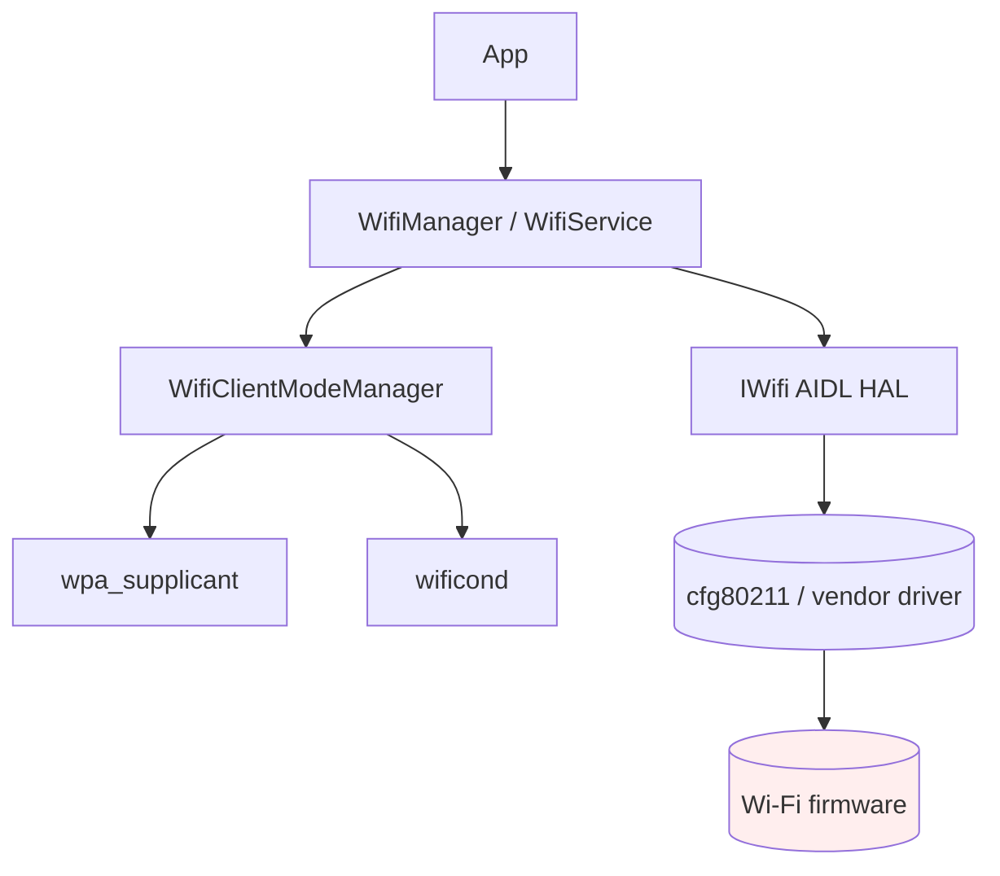
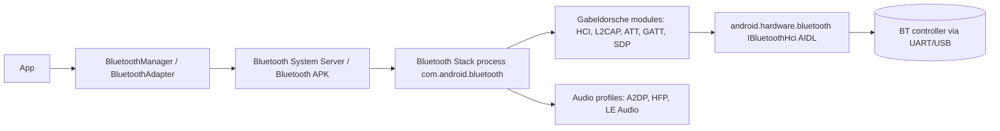
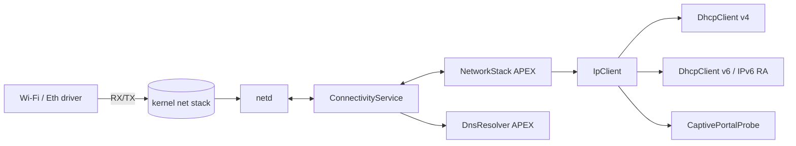
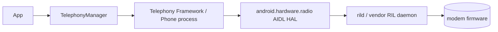

# Level 3B — Deep Dive: Connectivity (Wi-Fi, Bluetooth, NetworkStack, Telephony)

> **Curriculum days:** 53–54 · **Prereq:** [L3 HAL & Native](./level-03-hal-native.md), [L3A HAL Subsystems](./level-03a-deep-dive-hal-subsystems.md)
> **Primary target:** Android 15 on Cuttlefish · **Audience:** Mid → Staff

Connectivity in AOSP is *several stacks pretending to be one*. This chapter draws the lines and shows the seams.

---

## §3B.1 Wi-Fi Stack

### 🟦 Why it matters
Wi-Fi reliability is the #1 user-perceived quality metric on phones. The stack spans Java framework, native (`wificond`, `hostapd`, `wpa_supplicant`), HAL (`IWifi`/AIDL), kernel `cfg80211`/`mac80211`, and vendor firmware. A scan-stall regression can come from any of those layers.

### 📐 Concept



- **`WifiService`** — Java SystemService, public API.
- **`wificond`** — native daemon owning `nl80211` netlink to the driver; replaced legacy `netd` Wi-Fi paths.
- **`wpa_supplicant`** — auth/EAP/4-way handshake; talks to `wificond` via D-Bus.
- **`hostapd`** — soft-AP (tethering).
- **Wi-Fi HAL (AIDL)** — vendor extensions: chip mode, RTT, NAN, ANQP.
- **Driver/FW** — `cfg80211` + vendor module; firmware on device.

### 🛠️ Code Lab ��� Trigger and observe a scan

```bash
cf:# cmd wifi start-scan
cf:# cmd wifi list-scan-results
cf:# dumpsys wifi | head -80
cf:# logcat -s wpa_supplicant:V wificond:V WifiClientMode:V WifiManager:V
```
Inspect `nl80211` traffic (privileged, requires `iw`):
```bash
cf:# iw dev wlan0 scan dump | head
```

### ⚠️ Pitfalls
- "It works on engineering build, fails on user." → SELinux denies `wificond` netlink to driver; check `ag denied wificond`.
- BSSID roaming flapping under load → 802.11k/v BTM not implemented in firmware; framework backs off and reconnects.
- Hidden SSID timing — supplicant probe interval misconfigured, association takes 12 s.

### 🎓 Interview Questions
1. **[Mid]** What does `wificond` do that `wpa_supplicant` doesn't? *Scan management, low-level radio control via nl80211; supplicant focuses on auth/key-mgmt.*
2. **[Senior]** Walk a `WifiManager.connect()` from app to firmware. *Java → AIDL → `WifiServiceImpl` → `WifiClientModeManager` → `WifiNative` → `wificond` (`IWificond` HIDL→AIDL) + `wpa_supplicant` over `IWpaSupplicant` AIDL → driver via nl80211 → firmware → 4-way HS → `IpClient` for DHCP.*
3. **[Staff]** Diagnose: phone associates but no internet. *`dumpsys connectivity` link state; `IpClient` DHCP trace; check `dns.servers`; PNO + NAT64 if IPv6-only network.*

### 📋 Cheat-sheet
```text
adb shell cmd wifi list-networks
adb shell cmd wifi start-scan
adb shell dumpsys wifi
adb shell dumpsys wifiscanner
adb shell cmd wifi set-verbose-logging enabled
adb shell wpa_cli -i wlan0 status
adb shell logcat -s WifiHAL:V WifiVendorHal:V
```

---

## §3B.2 Bluetooth Stack (Gabeldorsche)

### 🟦 Why it matters
BT is a tower of standards (Classic + LE + LE Audio + Auracast). Modern AOSP uses **Gabeldorsche (GD)**, which replaced legacy `bluedroid` profiles. Knowing the GD module map saves hours when triaging "BT headset disconnects."

### 📐 Concept



Two separate BT HALs:
- `android.hardware.bluetooth.IBluetoothHci` — H4/H5 transport.
- `android.hardware.bluetooth.audio.IBluetoothAudioProvider` — A2DP/LE Audio offload.

### 🛠️ Code Lab — Pair & inspect

```bash
cf:# cmd bluetooth_manager enable
cf:# cmd bluetooth_manager pair AA:BB:CC:DD:EE:FF
cf:# dumpsys bluetooth_manager | head -60
cf:# btsnoop_enable                          # if available, or:
cf:# setprop persist.bluetooth.btsnoopenable true
cf:# stop bluetooth && start bluetooth        # capture btsnoop_hci.log
$ adb pull /data/misc/bluetooth/logs/btsnoop_hci.log
$ wireshark btsnoop_hci.log
```

### ⚠️ Pitfalls
- A2DP codec mismatch (LDAC requested by phone but not supported by sink) → silent fallback to SBC, audio quality drops.
- LE pairing fails on Android 14+ if `JUST_WORKS` policy disallowed by OEM config.

### 🎓 Interview Questions
1. **[Senior]** Why is the BT stack in its own process? *Sandboxing (UID `bluetooth`), restart isolation, sepolicy boundary.*
2. **[Staff]** Glitchy A2DP under camera load. *Codec offload negotiation; CPU contention on `bluetooth` process; check `dumpsys cpuinfo` and audio HAL offload state.*

### 📋 Cheat-sheet
```text
adb shell dumpsys bluetooth_manager
adb shell cmd bluetooth_manager enable
adb logcat -s bt_btif:V bt_stack:V BluetoothManagerService:V
adb pull /data/misc/bluetooth/logs/btsnoop_hci.log
```

---

## §3B.3 NetworkStack & IpClient

### 🟦 Why it matters
Since Android 10, `NetworkStack` is a Mainline (APEX) module — meaning a Play Store update can change DHCP/IP behavior on millions of devices overnight. IpClient is the brain.

### 📐 Concept



Key processes/UIDs:
- `system_server` hosts `ConnectivityService`.
- `com.android.networkstack` (APEX) hosts `NetworkStackService`, `IpClient`, `DhcpClient`.
- `netd` programs kernel routes, iptables (now nftables), socket marking.

### 🛠️ Code Lab — Trace IpClient on Cuttlefish

```bash
cf:# logcat -c
cf:# svc wifi disable && svc wifi enable
cf:# logcat -d -s IpClient:V DhcpClient:V ConnectivityService:V \
       NetworkMonitor:V CaptivePortalLogin:V > /tmp/ip.log
cf:# dumpsys connectivity | grep -A20 "Active default network"
cf:# dumpsys network_stack | head -40
```
Look for the IpClient state machine: `StoppedState → StartedState → RunningState`. DHCP states: `DhcpInitState → DhcpSelectingState → DhcpRequestingState → DhcpBoundState`.

### ⚠️ Pitfalls
- IPv6-only DHCPv6 + NAT64 misconfig → connectivity probes pass, apps fail. Check `dumpsys netd` Clat status.
- A NetworkStack APEX rollback (Mainline) wipes hard-learned roaming improvements.

### 🎓 Interview Questions
1. **[Senior]** Why is NetworkStack an APEX? *Updateability via Mainline; security fixes without OTA.*
2. **[Staff]** Captive portal detection logic. *NetworkMonitor probes `connectivitycheck.gstatic.com/generate_204`; HTTPS+HTTP; HTTP 200/204 sets `VALIDATED`; redirect → `CAPTIVE_PORTAL`.*

### 📋 Cheat-sheet
```text
adb shell dumpsys connectivity
adb shell dumpsys network_stack
adb shell dumpsys netd
adb shell ip rule
adb shell ip route show table all
adb shell logcat -s IpClient:V DhcpClient:V NetworkMonitor:V
```

---

## §3B.4 Telephony / RIL (pointer chapter)

> 🎯 **Staff insight:** Telephony deserves its own book. We point at the surface; deep-dive arrives in v2 of this manual.

### 📐 Concept



Modern radio is **AIDL** (Android 13+): `IRadioVoice`, `IRadioData`, `IRadioMessaging`, `IRadioModem`, `IRadioSim`, `IRadioNetwork`, `IRadioConfig`, `IRadioIms`. Each is independently versioned.

### 🛠️ Code Lab — RIL stub on Cuttlefish

The `cuttlefish` radio uses a Python `cuttlefish_modem.py` reachable via socket. To experiment:
```bash
cf:# logcat -s RILJ:V Telephony:V GsmCdmaPhone:V
cf:# cmd phone get-default-data-sub-id
cf:# dumpsys telephony.registry | head -60
```
Sample lab `curriculum/labs/ril-stub/` plugs in a minimal `IRadioVoice` impl that simulates an incoming call and a USSD response.

### ⚠️ Pitfalls
- Mismatched RIL AIDL version vs `vintf_fragments` → modem unavailable, no SIM.
- Forgetting `MULTI_SIM_CONFIG` property → only first sub registers.

### 🎓 Interview Questions
1. **[Senior]** Why split the radio HAL into 8 interfaces? *Versioning independence; OEMs ship voice before IMS, etc.*

### 📋 Cheat-sheet
```text
adb shell dumpsys telephony.registry
adb shell cmd phone tt
adb shell logcat -s RILJ:V RILD:V Telephony:V
```

---

## ✅ Verifying this chapter

You can finish Phase 4 days 53–54 when you can:

1. Trace a Wi-Fi connect from `cmd wifi connect-network` to firmware via `dumpsys` and `logcat`.
2. Capture a btsnoop log and open it in Wireshark.
3. Read an `IpClient` state-machine transition from log and explain it.
4. Identify which AIDL Radio HAL interface owns: an MO call, a CBS message, IMS registration.

🔗 Continue to [Level 4 — BSP & Bring-up](./level-04-bsp-bringup.md).

