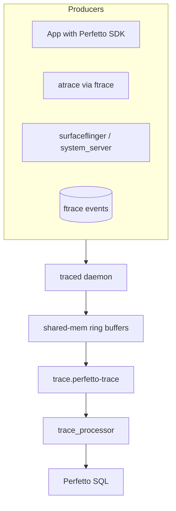

# Level 6A — Deep Dive: Performance Tracing (Perfetto, ftrace, BPF, dma-buf)

> **Curriculum days:** 75–79 · **Prereq:** [L6 Performance & Memory](./level-06-performance-memory.md), [L0A Kernel Deep Dive](./level-00a-deep-dive-kernel.md)
> **Primary target:** Android 15 · **Audience:** Senior → Staff

This is the chapter you reread before every performance war room. Tools change names every year (systrace → atrace → perfetto); the underlying mechanics (ftrace + sched events + tracepoints) do not.

---

## §6A.1 Perfetto Architecture

### 🟦 Why it matters
Perfetto is the *de facto* tracing system for Android since 10. Its SQL query layer (TraceProcessor) lets you write reusable jank-detection queries instead of eyeballing flame charts.

### 📐 Concept



Components:
- **`traced`** — central daemon, owns ring buffers.
- **`traced_probes`** — kernel-event producer, reads ftrace.
- **Producers** — apps and system processes via the Perfetto SDK / atrace bridge.
- **Consumers** — `perfetto` CLI; UI at `ui.perfetto.dev`.
- **`trace_processor`** — load `.perfetto-trace` and run SQL.

### 🛠️ Code Lab — Capture with a config and query

**`cfg.txt`**
```text
buffers: { size_kb: 65536, fill_policy: RING_BUFFER }
data_sources: {
  config { name: "linux.ftrace"
    ftrace_config {
      ftrace_events: "sched/sched_switch"
      ftrace_events: "sched/sched_waking"
      ftrace_events: "power/cpu_frequency"
      ftrace_events: "power/cpu_idle"
      atrace_categories: "gfx" atrace_categories: "view"
      atrace_categories: "wm"  atrace_categories: "am"
      atrace_apps: "*"
} } }
data_sources: { config { name: "linux.process_stats" } }
data_sources: { config { name: "android.surfaceflinger.frame" } }
duration_ms: 10000
```

```bash
cf:# perfetto -c /data/local/tmp/cfg.txt --txt -o /data/local/tmp/t.perfetto-trace
$ adb pull /data/local/tmp/t.perfetto-trace
$ trace_processor t.perfetto-trace
> SELECT name, dur/1e6 AS dur_ms FROM slice WHERE dur > 16e6 ORDER BY dur DESC LIMIT 20;
```

Find jank frames:
```sql
SELECT
  process.name AS app,
  COUNT(*) AS janky_frames
FROM expected_frame_timeline_slice efs
JOIN actual_frame_timeline_slice afs USING (display_frame_token)
JOIN thread USING (utid)
JOIN process USING (upid)
WHERE afs.dur > efs.dur
GROUP BY app
ORDER BY janky_frames DESC;
```

Full query pack: `curriculum/labs/perfetto-sql/queries/`.

### ⚠️ Pitfalls
- Buffer too small → lost events (`fill_policy: DISCARD`); use ring + larger size for short capture, then trigger via `trigger_perfetto`.
- `atrace_apps: "*"` is expensive; restrict in production captures.

### 🎓 Interview Questions
1. **[Senior]** What is the difference between `expected_frame_timeline` and `actual_frame_timeline`? *App-side vs SF-side; jank = actual.dur > expected.dur and tokens line up via display_frame_token.*
2. **[Staff]** Capture-on-symptom design. *Perfetto triggers + `trigger_perfetto`; producers write into ring buffer, only persist on trigger.*

### 📋 Cheat-sheet
```text
perfetto -c <cfg> --txt -o /data/local/tmp/t.perfetto-trace
perfetto --query-raw <sql> -o /tmp/q.json t.perfetto-trace
trace_processor <trace>      # interactive SQL
ui.perfetto.dev              # drag-drop UI
```

---

## §6A.2 ftrace Primer & Custom Events

### 🟦 Why it matters
Atrace is just an `echo` into `/sys/kernel/tracing`. Knowing ftrace directly unlocks tracing of kernel paths Atrace doesn't expose (custom drivers, BPF programs).

### 📐 Concept

```text
/sys/kernel/tracing/
  available_events           # all events the kernel knows
  events/sched/sched_switch/enable
  trace                      # human-readable ring buffer
  trace_pipe                 # blocking read
  set_event                  # echo "sched:sched_switch"
  per_cpu/cpu0/trace
```

### 🛠️ Code Lab — Custom tracepoint from a kernel module

**`hello_trace.c`** (excerpt)
```c
#define CREATE_TRACE_POINTS
#include "hello_trace_events.h"

static int __init hello_init(void) {
    trace_hello_event(42, "boot");
    return 0;
}
```
**`hello_trace_events.h`**
```c
#undef TRACE_SYSTEM
#define TRACE_SYSTEM hello
#if !defined(_HELLO_TRACE_H) || defined(TRACE_HEADER_MULTI_READ)
#define _HELLO_TRACE_H
#include <linux/tracepoint.h>
TRACE_EVENT(hello_event,
    TP_PROTO(int code, const char *msg),
    TP_ARGS(code, msg),
    TP_STRUCT__entry(__field(int, code) __string(msg, msg)),
    TP_fast_assign(__entry->code = code; __assign_str(msg, msg);),
    TP_printk("code=%d msg=%s", __entry->code, __get_str(msg))
);
#endif
#include <trace/define_trace.h>
```
Build, `insmod hello_trace.ko`, then:
```bash
cf:# echo 1 > /sys/kernel/tracing/events/hello/hello_event/enable
cf:# cat /sys/kernel/tracing/trace_pipe
```
Full source: `curriculum/labs/kmod-hello/` (extends Day 61 lab).

### 📋 Cheat-sheet
```text
atrace --list_categories
atrace -t 5 sched freq idle gfx view > /tmp/at.html
echo function_graph > /sys/kernel/tracing/current_tracer
echo sched:sched_switch >> /sys/kernel/tracing/set_event
```

---

## §6A.3 dma-buf Accounting & Leak Hunting

### 🟦 Why it matters
"Where did 800 MB of RAM go?" is almost always graphics buffers. dma-buf accounting (`/sys/kernel/dmabuf/buffers`, `dmabuf_dump`) is the only authoritative answer.

### 📐 Concept

A dma-buf is a kernel-side buffer with cross-process sharing semantics, used by gralloc4 for graphics, by camera ISP, by codec. Every fd is a refcount; leaks = unreleased fds.

### 🛠️ Code Lab — Pin down a leak

```bash
cf:# dmabuf_dump | head -40
cf:# dmabuf_dump --per-buffer | sort -k4 -n -r | head
cf:# cat /proc/<pid>/fdinfo/<fd>     # for an offending fd, see size/exporter
cf:# dumpsys gfxinfo
cf:# dumpsys meminfo --gpu
```

Cross-check with gralloc:
```bash
cf:# dumpsys SurfaceFlinger --buffers
```

### ⚠️ Pitfalls
- A camera HAL not releasing buffers on session close → grows monotonically; reproduces only after N camera open/close cycles.
- `dma-buf` accounted to importer process, not exporter → leaks look like they come from `system_server`.

### 🎓 Interview Questions
1. **[Senior]** Why does Android prefer dma-buf over ION? *ION deprecated; dma-buf is the upstream interface; ION removed from GKI.*
2. **[Staff]** A 24-hour soak shows +200 MB on `mediaserver`. Investigate. *`dmabuf_dump` over time, fd table delta, cross-ref `dumpsys media.codec`, suspect codec output buffers.*

### 📋 Cheat-sheet
```text
adb shell dmabuf_dump
adb shell dmabuf_dump --per-buffer
adb shell dumpsys SurfaceFlinger --buffers
adb shell dumpsys gfxinfo
adb shell cat /proc/meminfo | grep -i dma
```

---

## §6A.4 BPF on Android

### 🟦 Why it matters
Android uses BPF for traffic accounting (`netd`), time-in-state (`time_in_state`), thermal/power, and increasingly for security. Knowing how to load and inspect BPF programs is required for any "where did the bytes go?" question.

### 📐 Concept

Programs are compiled (`*.c` in AOSP `system/bpf/progs/` → `.o` → loaded by `bpfloader` at boot, pinned at `/sys/fs/bpf/`).

### 🛠️ Code Lab — Read a BPF map

```bash
cf:# ls /sys/fs/bpf/
cf:# bpftool map list
cf:# bpftool map dump pinned /sys/fs/bpf/map_netd_app_uid_stats_map | head
```

### 📋 Cheat-sheet
```text
ls /sys/fs/bpf/
bpftool prog list
bpftool map list
bpftool map dump pinned <path>
adb shell dumpsys netstats
```

---

## ✅ Verifying this chapter

You can finish Phase 7 days 75–79 when you can:

1. Author a Perfetto config that captures `gfx`, `sched`, `freq` for 10 s and find the top 5 jank frames via SQL.
2. Add a custom kernel tracepoint and observe it via `trace_pipe`.
3. Identify a dma-buf leak from `dmabuf_dump` deltas over a soak run.
4. Read a `netd` BPF map and explain how UID accounting works.

🔗 Continue to [Level 7 — Security](./level-07-security.md).

