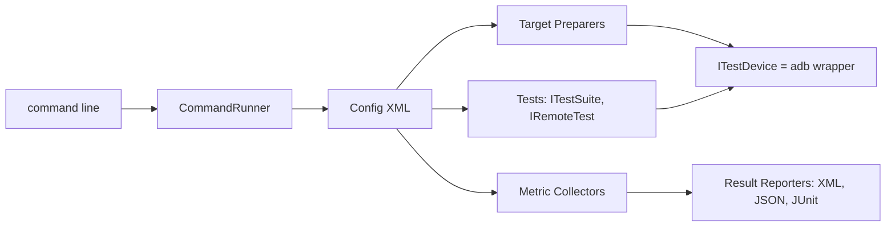
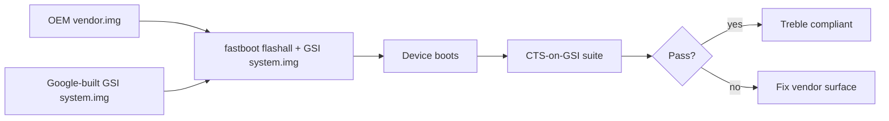

# Level 8A — Deep Dive: Tradefed (Test Harness, Sharding, CTS-on-GSI)

> **Curriculum days:** 88–92 · **Prereq:** [L8 Testing & Compatibility](./level-08-testing-compatibility.md)
> **Primary target:** Android 15 · **Audience:** Mid → Staff (Release Engineer, Test Lead)

Tradefed is the harness that runs CTS, VTS, GTS, STS, MTS, and your own. It's a Java program with a config language and a strong opinion about device control.

---

## §8A.1 Tradefed Architecture

### 🟦 Why it matters
A failing CTS module is rarely the test's fault — it's usually the harness misconfigured: wrong device target, missing apex, wrong shard. Knowing tradefed lets you bisect "is it my code or my harness?" in minutes.

### 📐 Concept



Key abstractions:
- **`ITestDevice`** — type-safe `adb` wrapper; `executeShellCommand`, `installPackage`, `pushFile`.
- **`ITargetPreparer`** — pre/post device setup (e.g., `RootTargetPreparer`, `DeviceSetup`).
- **`IRemoteTest` / `ITestSuite`** — the actual test runners (e.g., `AndroidJUnitTest`, `GTest`, `JarHostTest`).
- **`IMetricCollector`** — collects logcat, bugreports, perfetto on failure.
- **`IShardableTest`** — splits work across N invocations.

### 🛠️ Code Lab — Author a Tradefed module

Path: `cts/tests/myhal/` (or your vendor area).

**`AndroidTest.xml`**
```xml
<configuration description="VTS for ILight HAL">
    <option name="test-suite-tag" value="vts" />
    <target_preparer class="com.android.tradefed.targetprep.RootTargetPreparer" />
    <target_preparer class="com.android.tradefed.targetprep.PushFilePreparer">
        <option name="cleanup" value="true" />
        <option name="push" value="VtsHalLightTargetTest->/data/local/tmp/VtsHalLightTargetTest" />
    </target_preparer>
    <test class="com.android.tradefed.testtype.GTest">
        <option name="native-test-device-path" value="/data/local/tmp" />
        <option name="module-name" value="VtsHalLightTargetTest" />
        <option name="runtime-hint" value="2m" />
    </test>
</configuration>
```

**`Android.bp`**
```bp
cc_test {
    name: "VtsHalLightTargetTest",
    srcs: ["VtsHalLightTargetTest.cpp"],
    shared_libs: [
        "libbase", "libbinder_ndk", "liblog",
        "android.hardware.light-V2-ndk",
    ],
    test_suites: ["vts", "general-tests"],
}
```

**`VtsHalLightTargetTest.cpp`** (excerpt)
```cpp
TEST_P(LightHalTest, BoundsRespected) {
    HwLightState s{.color = 0xFFFF0000, .flashMode = FlashMode::NONE,
                   .brightnessMode = BrightnessMode::USER};
    // Iterate every reported light type
    std::vector<HwLight> lights; ASSERT_TRUE(light_->getLights(&lights).isOk());
    for (auto& l : lights) ASSERT_TRUE(light_->setLightState(l.id, s).isOk());
}
INSTANTIATE_TEST_SUITE_P(PerInstance, LightHalTest,
    ::testing::ValuesIn(android::getAidlHalInstanceNames(ILights::descriptor)),
    PrintInstanceNameToString);
```

Run:
```bash
$ source build/envsetup.sh && lunch aosp_cf_x86_64_phone-userdebug
$ m VtsHalLightTargetTest vts10
$ vts10 run vts -m VtsHalLightTargetTest
```

### 📋 Cheat-sheet
```text
cts-tradefed                                    # interactive shell
cts run cts -m CtsBluetoothTestCases            # single module
cts run cts --shard-count 4 --shard-index 0..3  # sharded
cts run cts --include-filter "Module#test"
vts run vts -m VtsHalLightTargetTest
sts-tradefed run sts-engbuild
```

---

## §8A.2 Sharding & Retry Strategies

### 🟦 Why it matters
A full CTS run is ~20+ hours on a single device. Smart sharding turns it into 2 hours on 10 devices. Retry strategy decides whether you ship on time.

### 📐 Concept

Sharding levels:
1. **Module-level** — `--shard-count 4` distributes modules.
2. **Test-level** — within a module, JUnit/GTest tests are split.
3. **Device-level** — `--parallel-setup` runs preparers concurrently.

Retry policies:
- `--retry <session>` — re-run only failures from prior session.
- `--max-testcase-run-count 3` — flake suppression (use sparingly).
- `--retry-strategy RETRY_ANY_FAILURE` vs `RERUN_UNTIL_FAILURE`.

### 🛠️ Code Lab — Shard CTS across 4 Cuttlefish instances

```bash
$ for i in 0 1 2 3; do launch_cvd --num_instances=4 --base_instance_num=$((i+1)); done
$ for i in 0 1 2 3; do
    cts-tradefed run cts \
      --serial cvd-$((i+1)) \
      --shard-count 4 --shard-index $i \
      --plan cts &
  done
$ wait
$ cts-tradefed run retry --retry <session_id>
```

### ⚠️ Pitfalls
- Sharding by hash means test order changes — order-dependent tests flake under sharding (and that's a real bug).
- Forgetting `--bugreport-on-failure` → debugging a flake from logs alone is pain.

### 🎓 Interview Questions
1. **[Senior]** How does `IShardableTest` differ from CLI sharding? *In-test sharding splits work via `split(N)` returning N runners; CLI sharding splits at module boundary.*
2. **[Staff]** Strategy for stable nightly CTS green. *Tiered: smoke → fast → full; quarantine list for known flakes; mandatory `--retry`; bisect via `git bisect run`.*

### 📋 Cheat-sheet
```text
cts run cts --shard-count N --shard-index I
cts run retry --retry <session>
cts list results
cts list invocations
cts dump bugreport
```

---

## §8A.3 CTS-on-GSI (Generic System Image)

### 🟦 Why it matters
GSI proves Treble compliance: drop a Google-built `system.img` on your `vendor.img` and run CTS. If it passes, your vendor surface is compliant.

### 📐 Concept



### 🛠️ Code Lab — Run CTS-on-GSI on Cuttlefish

```bash
$ # Build a GSI
$ lunch aosp_arm64-userdebug   # for arm device
$ m -j$(nproc)
$ # Flash GSI to your vendor-only target (CF or device)
$ fastboot flash system out/target/product/generic_arm64/system.img
$ fastboot reboot
$ cts-tradefed run cts-on-gsi
```

### 🎓 Interview Questions
1. **[Senior]** What does CTS-on-GSI prove that CTS doesn't? *That the vendor partition adheres to system-vendor interface (VINTF) without OEM patches above.*
2. **[Staff]** A CTS-on-GSI failure on `CtsBluetoothTestCases`. Triage. *Likely a HAL surface delta: HIDL vs AIDL, deprecated method; check `vintf check-compat` and `lshal --debug`.*

### 📋 Cheat-sheet
```text
cts run cts-on-gsi
cts run cts-on-gsi-r           # retry-friendly variant
vts run vts                    # paired test
```

---

## §8A.4 Other Suites Map

| Suite | Owner | Purpose | Cadence |
|---|---|---|---|
| **CTS** | Google | App-API compatibility | Every release |
| **VTS** | Google | HAL + kernel surface | Every release |
| **GTS** | Google (closed) | GMS / Play apps compat | Per-OEM |
| **STS** | Google | Security patches | Monthly |
| **MTS** | Google | Mainline (APEX) modules | Per APEX release |
| **xTS** | umbrella | Combined runs | Per release |

---

## ✅ Verifying this chapter

You can finish Phase 9 when you can:

1. Author a Tradefed `AndroidTest.xml` for a GTest binary.
2. Run a single CTS module and apply `--retry`.
3. Shard CTS across N Cuttlefish instances and merge results.
4. Explain CTS vs VTS vs GTS vs STS vs MTS vs xTS in one sentence each.

🔗 Continue to [Level 9 — Production Release](./level-09-production-release.md).

